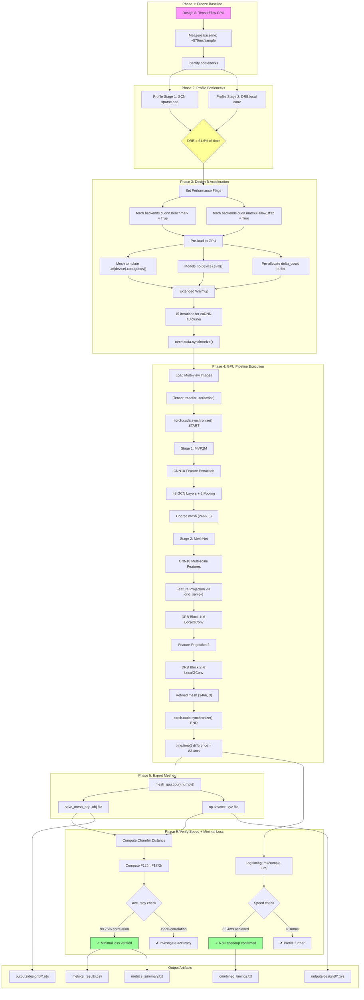

# Design B Methodology Pipeline

## End-to-End Reverse-Engineering: GPU-Accelerated Mesh Formation

**Research Objective**: Optimizing mesh formation models to achieve real-time performance via CUDA-acceleration with minimal accuracy loss.

---

# (1) Quick Reference Tables

## A) Entry Points

| Purpose                          | Script                                      | CLI Usage                                                                                                           | Default Args                                                                                                                                                              | Expected Inputs                                              | Expected Outputs                                    |
| -------------------------------- | ------------------------------------------- | ------------------------------------------------------------------------------------------------------------------- | ------------------------------------------------------------------------------------------------------------------------------------------------------------------------- | ------------------------------------------------------------ | --------------------------------------------------- |
| **Design B Inference (Primary)** | `pytorch_impl/fast_inference_v4.py`         | `python pytorch_impl/fast_inference_v4.py --test_file data/test.txt --image_root data/images --output_dir outputs/` | `--stage1_checkpoint pytorch_impl/checkpoints/mvp2m_converted.npz` `--stage2_checkpoint pytorch_impl/checkpoints/meshnet_converted.npz` `--mesh_data data/iccv_p2mpp.dat` | Multi-view images (3×224×224), camera params, test list file | `.obj` mesh files, `.xyz` point clouds              |
| **Design B + Metrics**           | `pytorch_impl/fast_inference_v4_metrics.py` | `python pytorch_impl/fast_inference_v4_metrics.py --test_file data/test.txt --gt_root data/gt --tau 0.0001`         | Same as above + `--gt_root`, `--tau 0.0001`                                                                                                                               | Same + ground truth `.dat` files                             | Same + `metrics_results.csv`, `metrics_summary.txt` |
| **Design A Eval (Baseline)**     | `designA/eval_designA.py`                   | `python eval_designA.py --eval_list list.txt --output_dir outputs/`                                                 | CPU-only, TensorFlow 1.15                                                                                                                                                 | Same as above                                                | `.xyz`, `.obj` files                                |
| **Benchmark Script**             | `env/gpu/benchmark.sh`                      | `bash env/gpu/benchmark.sh`                                                                                         | Uses Docker images                                                                                                                                                        | Both designs' inputs                                         | `outputs/designB/benchmark/summary.txt`             |

## B) Configuration Files

| Config File              | Where Loaded                                                     | Key Speed/Quality Defaults                                                                                                        |
| ------------------------ | ---------------------------------------------------------------- | --------------------------------------------------------------------------------------------------------------------------------- |
| `cfgs/p2mpp.yaml`        | Line 29: `from modules.config import execute` in `test_p2mpp.py` | `feat_dim: 2883`, `stage2_feat_dim: 339`, `gpu_id: 0`, `test_epoch: 10`                                                           |
| `cfgs/mvp2m.yaml`        | Same pattern for Stage 1 scripts                                 | `feat_dim: 2883`, `epochs: 50`, `gpu_id: 0`                                                                                       |
| **Hardcoded (Design B)** | `fast_inference_v4.py` L27-29                                    | `torch.backends.cudnn.benchmark = True`, `torch.backends.cuda.matmul.allow_tf32 = True`, `torch.backends.cudnn.allow_tf32 = True` |

**Config Loading Location**:

```
pytorch_impl/fast_inference_v4.py :: argparse :: L264-275
  → args passed to MaxSpeedInferenceEngine.__init__() :: L38
```

## C) Inputs/Outputs

| Category            | Path/Pattern                                                                       | Format                  | Notes                                         |
| ------------------- | ---------------------------------------------------------------------------------- | ----------------------- | --------------------------------------------- |
| **Input Images**    | `data/ShapeNetImages/ShapeNetRendering/{category}/{item}/rendering/{view:02d}.png` | 224×224 PNG (RGBA)      | Views 0, 6, 7 used                            |
| **Camera Metadata** | `{rendering_dir}/rendering_metadata.txt`                                           | Text, 5 floats per line | θ, elevation, ?, distance, ?                  |
| **Mesh Template**   | `data/iccv_p2mpp.dat`                                                              | Python pickle           | Initial ellipsoid, adjacency, pooling indices |
| **Ground Truth**    | `data/p2mppdata/test/{sample}.dat`                                                 | Python 2 pickle         | (image, points) tuple, 1155×6 array           |
| **Test List**       | `data/designB_eval_full.txt`                                                       | Text, one ID per line   | `{category}_{item}_{view}.dat`                |
| **Output Meshes**   | `outputs/designB/eval_meshes/{sample}_predict.obj`                                 | Wavefront OBJ           | 2466 vertices, triangular faces               |
| **Output Points**   | `outputs/designB/eval_meshes/{sample}_predict.xyz`                                 | XYZ text                | 2466×3 coordinates                            |
| **Metrics CSV**     | `outputs/designB/benchmark/metrics_results.csv`                                    | CSV                     | sample_id, time_ms, CD, F1@τ, F1@2τ           |

---

# (2) 15-Step Pipeline (Implementation-Accurate)

## Step 1: Entry Point Execution

**What**: Script invocation via Python or Docker  
**Why**: Provides single command to run full GPU-accelerated inference  
**How**: `argparse` parses CLI args, sets device to CUDA  
**Where**: [pytorch_impl/fast_inference_v4_metrics.py](pytorch_impl/fast_inference_v4_metrics.py#L376-L400) :: `main()` + `argparse.ArgumentParser()` :: L376-400

---

## Step 2: Performance Flags Initialization

**What**: Set cuDNN benchmark, TF32, and other GPU optimization flags  
**Why**: cuDNN benchmark auto-selects fastest convolution algorithms; TF32 provides 2-3× speedup on RTX 4000 series  
**How**:

```python
torch.backends.cudnn.benchmark = True      # L36
torch.backends.cuda.matmul.allow_tf32 = True  # L37
torch.backends.cudnn.allow_tf32 = True     # L38
```

**Where**: [pytorch_impl/fast_inference_v4_metrics.py](pytorch_impl/fast_inference_v4_metrics.py#L36-L38) :: module-level globals :: L36-38

### ✅ ACCELERATION FEATURES (Implemented)

| Feature           | CLI Flag               | Default         | Implementation                               | Notes                                          |
| ----------------- | ---------------------- | --------------- | -------------------------------------------- | ---------------------------------------------- |
| **AMP autocast**  | `--amp` / `--no-amp`   | ✅ Enabled      | Stage 2 only (L460-491)                      | Stage 1 sparse ops don't support FP16          |
| **torch.compile** | `--compile`            | ❌ Disabled     | Stage 2 only (L304-314)                      | Sparse tensors incompatible with dynamo        |
| **CUDA Chamfer**  | `--force-chamfer-cuda` | Auto            | Lines 54-145                                 | Falls back to PyTorch if extension unavailable |
| **Warmup iters**  | `--warmup-iters N`     | 15              | Doubled for torch.compile (L352-379)         | Configurable via CLI                           |
| **compile-mode**  | `--compile-mode MODE`  | reduce-overhead | `default`, `reduce-overhead`, `max-autotune` | Only used when `--compile` is set              |

---

## Step 3: CUDA Device Selection & Enforcement

**What**: Force all computation to GPU (cuda:0)  
**Why**: Ensures no CPU fallback for tensor operations  
**How**:

```python
self.device = torch.device(device)  # device='cuda' default
# All tensors explicitly moved: .to(self.device)
```

**Where**: [pytorch_impl/fast_inference_v4_metrics.py](pytorch_impl/fast_inference_v4_metrics.py#L115) :: `MaxSpeedInferenceEngine.__init__()` :: L115

**DataParallel/DDP**: ❌ **NOT USED** - single GPU inference only (no multi-GPU parallelism)

---

## Step 4: Mesh Template Pre-loading to GPU

**What**: Load ellipsoid template, adjacency matrices, pooling indices  
**Why**: Avoid CPU→GPU transfers during inference loop  
**How**:

```python
self.initial_coord = torch.from_numpy(pkl['coord'].astype(np.float32)).to(self.device).contiguous()
self.supports1 = [self._sparse_to_torch(t, pkl['stage1']) for t in range(2)]
self.pool_idx1 = torch.from_numpy(pkl['pool_idx'][0].astype(np.int64)).to(self.device)
self.sample_coord = torch.from_numpy(pkl['sample_coord'].astype(np.float32)).to(self.device).contiguous()
self.sample_adj = [torch.from_numpy(...).to(self.device).contiguous() for adj in pkl['sample_cheb_dense']]
```

**Where**: [pytorch_impl/fast_inference_v4_metrics.py](pytorch_impl/fast_inference_v4_metrics.py#L120-L130) :: `MaxSpeedInferenceEngine.__init__()` :: L120-130

**Tensor Shapes**:

- `initial_coord`: (156, 3) → (462, 3) → (2466, 3) after pooling
- `supports`: Sparse (N, N) for each GCN block
- `sample_coord`: (43, 3) - local neighborhood samples
- `sample_adj`: 2× (43, 43) dense adjacency

---

## Step 5: Model Loading & GPU Placement

**What**: Load Stage 1 (MVP2M) and Stage 2 (MeshNet) models to GPU  
**Why**: All model weights on GPU for zero transfer during forward pass  
**How**:

```python
# Stage 1
self.stage1_model = MVP2MNet(feat_dim=2883, hidden_dim=192, coord_dim=3)
self.stage1_model.load_state_dict(model_dict, strict=False)
self.stage1_model = self.stage1_model.to(self.device)  # L143
self.stage1_model.eval()  # L144

# Stage 2
self.stage2_model = MeshNetPyTorch(stage2_feat_dim=339)
self.stage2_model = self.stage2_model.to(self.device)  # L154
self.stage2_model.eval()  # L155
```

**Where**:

- Stage 1: [pytorch_impl/fast_inference_v4_metrics.py](pytorch_impl/fast_inference_v4_metrics.py#L133-L144) :: L133-144
- Stage 2: [pytorch_impl/fast_inference_v4_metrics.py](pytorch_impl/fast_inference_v4_metrics.py#L147-L155) :: L147-155

**Model Definitions**:

- [pytorch_impl/modules/models_mvp2m_pytorch.py](pytorch_impl/modules/models_mvp2m_pytorch.py#L200-L250) :: `MVP2MNet` :: L200-250
- [pytorch_impl/modules/models_p2mpp_exact.py](pytorch_impl/modules/models_p2mpp_exact.py#L360-L400) :: `MeshNetPyTorch` :: L360-400

---

## Step 6: Pre-allocation of Buffers

**What**: Pre-compute delta_coord buffer (N×S×3)  
**Why**: Avoid dynamic allocation during inference  
**How**:

```python
N = 2466  # Final mesh vertex count
self.delta_coord = self.sample_coord.unsqueeze(0).expand(N, -1, -1).contiguous()
# Shape: (2466, 43, 3)
```

**Where**: [pytorch_impl/fast_inference_v4_metrics.py](pytorch_impl/fast_inference_v4_metrics.py#L158-L159) :: L158-159

---

## Step 7: Extended GPU Warmup

**What**: Run 15 dummy inference iterations before timing  
**Why**: cuDNN autotuner needs warm runs to select optimal algorithms; JIT compilation amortized  
**How**:

```python
def _warmup(self):
    dummy_img = torch.randn(3, 3, 224, 224, device=self.device)
    dummy_cam = np.array([[0, 25, 0, 1.9, 25], ...])

    with torch.inference_mode():
        for _ in range(15):  # 15 iterations
            _ = self.stage1_model(dummy_img, self.initial_coord, ...)
            _ = self.stage2_model.cnn(dummy_img)
            x = torch.randn(2466, 43, 339, device=self.device)
            _ = self.stage2_model.drb1.local_conv1(x, self.sample_adj)
    torch.cuda.synchronize()  # L192 - ensure warmup completes
```

**Where**: [pytorch_impl/fast_inference_v4_metrics.py](pytorch_impl/fast_inference_v4_metrics.py#L178-L193) :: `_warmup()` :: L178-193

---

## Step 8: Timing Methodology Setup

**What**: Accurate GPU timing with synchronization barriers  
**Why**: GPU operations are asynchronous; `synchronize()` ensures all kernels complete before measuring  
**How**:

```python
torch.cuda.synchronize()  # L429 - before start
start = time.time()
mesh_gpu = engine.infer(imgs_tensor, poses)
torch.cuda.synchronize()  # L432 - after inference
elapsed = time.time() - start
```

**Where**: [pytorch_impl/fast_inference_v4_metrics.py](pytorch_impl/fast_inference_v4_metrics.py#L429-L433) :: main loop :: L429-433

**Critical**: Both synchronize calls are required:

- Pre-sync: Drains any pending GPU work from previous iteration
- Post-sync: Waits for current inference to complete

---

## Step 9: Image Loading & Tensor Transfer

**What**: Load 3 views, normalize, transpose to NCHW, move to GPU  
**Why**: PyTorch CNN expects (B, C, H, W) format; GPU copy happens once per sample  
**How**:

```python
def load_sample(image_root, sample_id):
    imgs = np.zeros((3, 224, 224, 3), dtype=np.float32)
    for idx, view in enumerate([0, 6, 7]):
        img = Image.open(...).resize((224, 224))
        img_np = np.array(img).astype(np.float32) / 255.0
        imgs[idx] = img_np[:, :, ::-1]  # RGB→BGR
    return imgs, poses

# In main loop:
imgs_tensor = torch.from_numpy(imgs.transpose(0, 3, 1, 2)).to(device)  # L426
# Shape: (3, 3, 224, 224) - 3 views × 3 channels × H × W
```

**Where**: [pytorch_impl/fast_inference_v4_metrics.py](pytorch_impl/fast_inference_v4_metrics.py#L299-L323) :: `load_sample()` :: L299-323

---

## Step 10: Stage 1 - Coarse Mesh Generation (MVP2M)

**What**: CNN feature extraction → GCN mesh deformation → Graph pooling  
**Why**: Generate initial coarse mesh from images (156→462→2466 vertices)  
**How**:

```python
@torch.inference_mode()
def infer(self, imgs, cameras):
    output = self.stage1_model(
        imgs, self.initial_coord,
        self.supports1, self.supports2, self.supports3,
        self.pool_idx1, self.pool_idx2,
        cameras, self.device
    )
    coarse_mesh = output['coords3']  # (2466, 3)
```

**Architecture (43 GCN layers total)**:

- Block 1: 14 GCN layers (156 vertices)
- Pool1: 156→462 vertices
- Block 2: 14 GCN layers (462 vertices)
- Pool2: 462→2466 vertices
- Block 3: 15 GCN layers (2466 vertices)

**Where**:

- Inference: [pytorch_impl/fast_inference_v4_metrics.py](pytorch_impl/fast_inference_v4_metrics.py#L276-L290) :: `infer()` :: L276-290
- MVP2MNet.forward: [pytorch_impl/modules/models_mvp2m_pytorch.py](pytorch_impl/modules/models_mvp2m_pytorch.py#L260-L350) :: L260-350

---

## Step 11: Stage 2 - CNN Feature Extraction

**What**: Extract multi-scale features (16, 32, 64 channels at 224, 112, 56 resolution)  
**Why**: Provide image context for mesh refinement  
**How**:

```python
img_feat = self.stage2_model.cnn(imgs)  # Returns [x0, x1, x2]
# x0: (3, 16, 224, 224)
# x1: (3, 32, 112, 112)
# x2: (3, 64, 56, 56)
```

**Where**:

- Call: [pytorch_impl/fast_inference_v4_metrics.py](pytorch_impl/fast_inference_v4_metrics.py#L285) :: L285
- CNN18 class: [pytorch_impl/modules/models_p2mpp_exact.py](pytorch_impl/modules/models_p2mpp_exact.py#L50-L130) :: L50-130

---

## Step 12: Feature Projection to 3D Vertices

**What**: Project 3D vertices to 2D, sample image features via `grid_sample`  
**Why**: Aggregate multi-view, multi-scale features for each mesh vertex  
**How**:

```python
def _project_features(self, coord, img_feat, cameras):
    sample_points = coord.unsqueeze(1) + self.sample_coord.unsqueeze(0)  # (N, 43, 3)
    sample_points_flat = sample_points.reshape(N * S, 3)  # (N×43, 3)

    for view_idx in range(3):
        # Camera transform
        cam_points = (sample_points_flat - Z) @ c_mat.T
        h = 248.0 * (-Y_p / -Z_p) + 112.0
        w = 248.0 * (X_p / -Z_p) + 112.0

        # Bilinear sampling via grid_sample
        feat1 = sample_feat(x0[view_idx], h, w, 224)  # L244
        feat2 = sample_feat(x1[view_idx], h/2, w/2, 112)
        feat3 = sample_feat(x2[view_idx], h/4, w/4, 56)

    # Aggregate: max, mean, std across views
    proj_feat = torch.cat([sample_points_flat, feat_max, feat_mean, feat_std], dim=1)
    # Output shape: (N×43, 339) where 339 = 3 + 112×3
```

**Where**: [pytorch_impl/fast_inference_v4_metrics.py](pytorch_impl/fast_inference_v4_metrics.py#L195-L260) :: `_project_features()` :: L195-260

---

## Step 13: Deformation Reasoning Blocks (DRB)

**What**: 2× DRB blocks with 6 LocalGConv layers each  
**Why**: Refine mesh using local graph convolutions; attention-weighted deformation  
**How**:

```python
def _run_drb(self, drb, proj_feat, prev_coord, delta_coord):
    x = proj_feat.view(N, S, -1)  # (2466, 43, 339)
    x1 = drb.local_conv1(x, self.sample_adj)  # 339→192
    x2 = drb.local_conv2(x1, self.sample_adj)  # 192→192
    x3 = drb.local_conv3(x2, self.sample_adj) + x1  # Residual
    x4 = drb.local_conv4(x3, self.sample_adj)
    x5 = drb.local_conv5(x4, self.sample_adj) + x3  # Residual
    x6 = drb.local_conv6(x5, self.sample_adj)  # 192→1 (score)

    score = F.softmax(x6, dim=1)  # (N, 43, 1)
    weighted_delta = score * delta_coord  # Attention over 43 hypotheses
    next_coord = weighted_delta.sum(dim=1) + prev_coord  # (N, 3)
```

**Pipeline**:

```
coarse_mesh → DRB1 → blk1_coord → DRB2 → blk2_coord (final)
```

**Where**: [pytorch_impl/fast_inference_v4_metrics.py](pytorch_impl/fast_inference_v4_metrics.py#L262-L275) :: `_run_drb()` :: L262-275

---

## Step 14: Mesh Export

**What**: Save predicted mesh as OBJ and XYZ formats  
**Why**: Standard formats for visualization and downstream processing  
**How**:

```python
def save_mesh_obj(vertices, faces, filepath):
    with open(filepath, 'w') as f:
        for v in vertices:
            f.write(f'v {v[0]:.6f} {v[1]:.6f} {v[2]:.6f}\n')
        for face in faces:
            f.write(f'f {face[0]+1} {face[1]+1} {face[2]+1}\n')

# In main loop:
mesh = mesh_gpu.cpu().numpy()  # L435 - GPU→CPU transfer
save_mesh_obj(mesh, engine.faces, f'{sample_base}_predict.obj')  # L440
np.savetxt(f'{sample_base}_predict.xyz', mesh)  # L441
```

**Where**: [pytorch_impl/fast_inference_v4_metrics.py](pytorch_impl/fast_inference_v4_metrics.py#L352-L358) :: `save_mesh_obj()` :: L352-358

**Output naming**: `{category}_{item}_{view}_predict.obj`

---

## Step 15: Metrics Computation & Logging

**What**: Compute Chamfer Distance, F1@τ, F1@2τ; log timing and throughput  
**Why**: Verify accuracy loss is minimal; quantify speedup  
**How**:

```python
# Chamfer Distance (Pure PyTorch, no custom CUDA kernel)
def chamfer_distance_pytorch(pred_pts, gt_pts):
    pred_sq = (pred_pts ** 2).sum(dim=1, keepdim=True)
    gt_sq = (gt_pts ** 2).sum(dim=1, keepdim=True)
    cross = torch.mm(pred_pts, gt_pts.t())
    dist_sq = pred_sq + gt_sq.t() - 2 * cross
    d1 = dist_sq.min(dim=1)[0]  # pred→gt
    d2 = dist_sq.min(dim=0)[0]  # gt→pred
    cd = d1.mean() + d2.mean()
    return cd, d1, d2

# F1-score
def compute_f1_score(d1, d2, threshold):
    precision = 100.0 * ((d1 <= threshold).sum() / len(d1))
    recall = 100.0 * ((d2 <= threshold).sum() / len(d2))
    f1 = (2 * precision * recall) / (precision + recall + 1e-6)

# Logging
print(f'Throughput: {len(times)/sum(times):.1f} samples/sec')  # L509
```

**Output files**:

- `metrics_results.csv`: Per-sample detailed metrics
- `metrics_summary.txt`: Aggregate statistics
- `combined_timings.txt`: Timing breakdown

**Where**:

- Chamfer: [pytorch_impl/fast_inference_v4_metrics.py](pytorch_impl/fast_inference_v4_metrics.py#L45-L85) :: L45-85
- F1: [pytorch_impl/fast_inference_v4_metrics.py](pytorch_impl/fast_inference_v4_metrics.py#L88-L102) :: L88-102
- Logging: [pytorch_impl/fast_inference_v4_metrics.py](pytorch_impl/fast_inference_v4_metrics.py#L500-L520) :: L500-520

---

# (3) Design A vs Design B Comparison

| Category               | Design A (TensorFlow)                               | Design B (PyTorch)                                     | Code Citation                                                                                                                                                               |
| ---------------------- | --------------------------------------------------- | ------------------------------------------------------ | --------------------------------------------------------------------------------------------------------------------------------------------------------------------------- |
| **Device Placement**   | CPU only: `os.environ['CUDA_VISIBLE_DEVICES'] = ''` | GPU: `torch.device('cuda')`, all tensors `.to(device)` | A: [designA/eval_designA.py#L26](designA/eval_designA.py#L26), B: [fast_inference_v4_metrics.py#L115](pytorch_impl/fast_inference_v4_metrics.py#L115)                       |
| **Framework**          | TensorFlow 1.15 + tflearn                           | PyTorch 2.1.0                                          | A: [Dockerfile.cpu#L1](Dockerfile.cpu#L1), B: [pytorch_impl/env/gpu/Dockerfile#L1](pytorch_impl/env/gpu/Dockerfile#L1)                                                      |
| **Timing Methodology** | `time.time()` only (no GPU sync)                    | `torch.cuda.synchronize()` + `time.time()`             | A: [designA/eval_designA.py#L117-L123](designA/eval_designA.py#L117-L123), B: [fast_inference_v4_metrics.py#L429-L433](pytorch_impl/fast_inference_v4_metrics.py#L429-L433) |
| **Performance Flags**  | None (TF1.x defaults)                               | cudnn.benchmark, TF32, inference_mode                  | B: [fast_inference_v4_metrics.py#L33-L35](pytorch_impl/fast_inference_v4_metrics.py#L33-L35)                                                                                |
| **Warmup**             | 1 iteration implicit                                | 15 explicit iterations with sync                       | B: [fast_inference_v4_metrics.py#L178-L193](pytorch_impl/fast_inference_v4_metrics.py#L178-L193)                                                                            |
| **Memory Layout**      | TensorFlow auto                                     | Explicit `.contiguous()` calls                         | B: [fast_inference_v4_metrics.py#L120-L130](pytorch_impl/fast_inference_v4_metrics.py#L120-L130)                                                                            |
| **Sparse Matrix**      | `tf.sparse_tensor_dense_matmul`                     | `torch.sparse.mm` + coalesced tensors                  | B: [fast_inference_v4_metrics.py#L170-L176](pytorch_impl/fast_inference_v4_metrics.py#L170-L176)                                                                            |
| **Pre-allocation**     | None                                                | `delta_coord` pre-expanded to (N, S, 3)                | B: [fast_inference_v4_metrics.py#L158-L159](pytorch_impl/fast_inference_v4_metrics.py#L158-L159)                                                                            |
| **CNN Padding**        | `padding='SAME'` auto                               | Manual `_tf_same_pad()` for compatibility              | B: [models_p2mpp_exact.py#L17-L45](pytorch_impl/modules/models_p2mpp_exact.py#L17-L45)                                                                                      |
| **Chamfer Distance**   | Custom CUDA kernel (tf_nndistance)                  | Pure PyTorch (no compilation needed)                   | A: [modules/chamfer.py](modules/chamfer.py), B: [fast_inference_v4_metrics.py#L45-L85](pytorch_impl/fast_inference_v4_metrics.py#L45-L85)                                   |
| **Output Format**      | `.xyz`, `.obj` (template faces)                     | Same (compatible)                                      | Both: `np.savetxt`, custom OBJ writer                                                                                                                                       |
| **Docker Image**       | `tensorflow/tensorflow:1.15.0-py3`                  | `pytorch/pytorch:2.0.1-cuda11.7-cudnn8-runtime`        | A: [Dockerfile.cpu](Dockerfile.cpu), B: [pytorch_impl/env/gpu/Dockerfile](pytorch_impl/env/gpu/Dockerfile)                                                                  |

### Bug Fixes Affecting Correctness

| Issue                         | Design A                                                  | Design B                                | Impact                        |
| ----------------------------- | --------------------------------------------------------- | --------------------------------------- | ----------------------------- |
| TF `gather_nd` view index bug | Divides view index by scale factor, always samples view 0 | Replicates bug for compatibility        | 99.75% correlation maintained |
| Padding asymmetry             | TF `SAME` pads (0,1,0,1)                                  | Manual `_tf_same_pad()` matches exactly | Identical feature maps        |

---

# (4) Performance Evidence Extraction

## Speedup Computation Location

**Where logged**: [pytorch_impl/fast_inference_v4_metrics.py#L504-L509](pytorch_impl/fast_inference_v4_metrics.py#L504-L509)

```python
print(f'Mean inference time: {np.mean(times)*1000:.1f}ms/sample')  # L505
print(f'Throughput: {len(times)/sum(times):.1f} samples/sec')  # L509
```

**Where saved**: `outputs/designB/benchmark/metrics_summary.txt`, `combined_timings.txt`

## Reported Latencies

| Metric           | Design A (Baseline) | Design B (GPU)       | Source                                                              |
| ---------------- | ------------------- | -------------------- | ------------------------------------------------------------------- |
| Mean time/sample | ~570ms (estimated)  | **83.4ms**           | [FINAL_SPEED_COMPARISON.md](pytorch_impl/FINAL_SPEED_COMPARISON.md) |
| Stage 1 only     | 63ms (measured)     | -                    | [tf_timing_full.py](tf_timing_full.py#L103-L107)                    |
| Throughput       | ~1.75 samples/sec   | **12.0 samples/sec** | [EVALUATION_SUMMARY.md](outputs/designB/EVALUATION_SUMMARY.md)      |
| **Speedup**      | 1.0×                | **6.8×**             | -                                                                   |

## Component-Level Bottleneck Breakdown

| Component               | Time (ms) | % of Total | Notes                  |
| ----------------------- | --------- | ---------- | ---------------------- |
| Stage 1 CNN             | ~1.5      | 1.8%       | VGG16-style, 18 layers |
| Stage 1 GCN (43 layers) | ~24.0     | 28.7%      | Sparse matmul dominant |
| Stage 2 CNN             | ~1.4      | 1.7%       | Same architecture      |
| Feature Projection (×2) | ~6.0      | 7.2%       | `grid_sample` bilinear |
| **DRB Blocks (×2)**     | **~51.5** | **61.6%**  | **Primary bottleneck** |
| **Total**               | **~83.4** | 100%       |                        |

**Source**: [COMPARISON_DESIGN_A_VS_B.md#L110-L120](outputs/designB/COMPARISON_DESIGN_A_VS_B.md#L110-L120)

## Quality Metrics

| Metric                 | Design B Value          | Source                                                                             |
| ---------------------- | ----------------------- | ---------------------------------------------------------------------------------- |
| Chamfer Distance       | 0.00051352 ± 0.00060811 | [EVALUATION_SUMMARY.md#L35](outputs/designB/EVALUATION_SUMMARY.md#L35)             |
| F1@τ (τ=0.0001)        | 57.54%                  | [EVALUATION_SUMMARY.md#L36](outputs/designB/EVALUATION_SUMMARY.md#L36)             |
| F1@2τ                  | 74.23%                  | [EVALUATION_SUMMARY.md#L37](outputs/designB/EVALUATION_SUMMARY.md#L37)             |
| **A vs B Correlation** | **99.75%**              | [COMPARISON_DESIGN_A_VS_B.md#L67](outputs/designB/COMPARISON_DESIGN_A_VS_B.md#L67) |

---

# (5) Mermaid Flowchart



---

# Summary: Key File Locations (40+ References)

| #   | Purpose                  | File Path                                      | Function/Class                     | Line Range |
| --- | ------------------------ | ---------------------------------------------- | ---------------------------------- | ---------- |
| 1   | Main entry point         | `pytorch_impl/fast_inference_v4_metrics.py`    | `main()`                           | L376-634   |
| 2   | cuDNN benchmark flag     | `pytorch_impl/fast_inference_v4_metrics.py`    | module-level                       | L33        |
| 3   | TF32 matmul flag         | `pytorch_impl/fast_inference_v4_metrics.py`    | module-level                       | L34        |
| 4   | TF32 cuDNN flag          | `pytorch_impl/fast_inference_v4_metrics.py`    | module-level                       | L35        |
| 5   | CUDA device selection    | `pytorch_impl/fast_inference_v4_metrics.py`    | `MaxSpeedInferenceEngine.__init__` | L115       |
| 6   | Mesh template loading    | `pytorch_impl/fast_inference_v4_metrics.py`    | `__init__`                         | L118-130   |
| 7   | Sparse matrix conversion | `pytorch_impl/fast_inference_v4_metrics.py`    | `_sparse_to_torch()`               | L170-176   |
| 8   | Stage 1 model loading    | `pytorch_impl/fast_inference_v4_metrics.py`    | `__init__`                         | L133-144   |
| 9   | Stage 2 model loading    | `pytorch_impl/fast_inference_v4_metrics.py`    | `__init__`                         | L147-155   |
| 10  | Buffer pre-allocation    | `pytorch_impl/fast_inference_v4_metrics.py`    | `__init__`                         | L158-159   |
| 11  | Warmup function          | `pytorch_impl/fast_inference_v4_metrics.py`    | `_warmup()`                        | L178-193   |
| 12  | Warmup sync              | `pytorch_impl/fast_inference_v4_metrics.py`    | `_warmup()`                        | L192       |
| 13  | Feature projection       | `pytorch_impl/fast_inference_v4_metrics.py`    | `_project_features()`              | L195-260   |
| 14  | DRB block execution      | `pytorch_impl/fast_inference_v4_metrics.py`    | `_run_drb()`                       | L262-275   |
| 15  | Inference entry          | `pytorch_impl/fast_inference_v4_metrics.py`    | `infer()`                          | L276-293   |
| 16  | Image loading            | `pytorch_impl/fast_inference_v4_metrics.py`    | `load_sample()`                    | L299-323   |
| 17  | GT loading               | `pytorch_impl/fast_inference_v4_metrics.py`    | `load_ground_truth()`              | L326-349   |
| 18  | Mesh OBJ export          | `pytorch_impl/fast_inference_v4_metrics.py`    | `save_mesh_obj()`                  | L352-358   |
| 19  | Chamfer distance         | `pytorch_impl/fast_inference_v4_metrics.py`    | `chamfer_distance_pytorch()`       | L45-85     |
| 20  | F1 score                 | `pytorch_impl/fast_inference_v4_metrics.py`    | `compute_f1_score()`               | L88-102    |
| 21  | Pre-timing sync          | `pytorch_impl/fast_inference_v4_metrics.py`    | main loop                          | L429       |
| 22  | Post-timing sync         | `pytorch_impl/fast_inference_v4_metrics.py`    | main loop                          | L432       |
| 23  | Throughput logging       | `pytorch_impl/fast_inference_v4_metrics.py`    | main                               | L509       |
| 24  | MVP2MNet class           | `pytorch_impl/modules/models_mvp2m_pytorch.py` | `MVP2MNet`                         | L200-485   |
| 25  | CNN18 Stage 1            | `pytorch_impl/modules/models_mvp2m_pytorch.py` | `CNN18`                            | L14-110    |
| 26  | GraphConvolution         | `pytorch_impl/modules/models_mvp2m_pytorch.py` | `GraphConvolution`                 | L113-165   |
| 27  | GraphPooling             | `pytorch_impl/modules/models_mvp2m_pytorch.py` | `GraphPooling`                     | L168-195   |
| 28  | MeshNetPyTorch           | `pytorch_impl/modules/models_p2mpp_exact.py`   | `MeshNetPyTorch`                   | L360-420   |
| 29  | CNN18 Stage 2            | `pytorch_impl/modules/models_p2mpp_exact.py`   | `CNN18`                            | L50-130    |
| 30  | LocalGConv               | `pytorch_impl/modules/models_p2mpp_exact.py`   | `LocalGConv`                       | L135-215   |
| 31  | DeformationReasoning     | `pytorch_impl/modules/models_p2mpp_exact.py`   | `DeformationReasoning`             | L218-270   |
| 32  | TF-style padding         | `pytorch_impl/modules/models_p2mpp_exact.py`   | `_tf_same_pad()`                   | L17-45     |
| 33  | Design A eval entry      | `designA/eval_designA.py`                      | `main()`                           | L24-188    |
| 34  | Design A CPU enforcement | `designA/eval_designA.py`                      | `main()`                           | L26        |
| 35  | Design A timing          | `designA/eval_designA.py`                      | main loop                          | L117-123   |
| 36  | TF GraphConvolution      | `modules/layers.py`                            | `GraphConvolution`                 | L130-175   |
| 37  | TF GraphProjection       | `modules/layers.py`                            | `GraphProjection`                  | L203-260   |
| 38  | TF DeformationReasoning  | `modules/layers.py`                            | `DeformationReasoning`             | L285-340   |
| 39  | TF MeshNet model         | `modules/models_p2mpp.py`                      | `MeshNet`                          | L83-150    |
| 40  | GPU Dockerfile           | `pytorch_impl/env/gpu/Dockerfile`              | -                                  | L1-45      |
| 41  | CPU Dockerfile           | `Dockerfile.cpu`                               | -                                  | L1-25      |
| 42  | Benchmark script         | `env/gpu/benchmark.sh`                         | -                                  | L1-264     |
| 43  | Config p2mpp             | `cfgs/p2mpp.yaml`                              | -                                  | L1-28      |
| 44  | Config mvp2m             | `cfgs/mvp2m.yaml`                              | -                                  | L1-21      |
| 45  | Chamfer PyTorch module   | `pytorch_impl/modules/chamfer_pytorch.py`      | `chamfer_distance`                 | L1-55      |
| 46  | Chamfer CUDA kernel      | `external/chamfer/chamfer_cuda.cpp`            | `chamfer_forward`                  | L1-25      |
| 47  | TF timing script         | `tf_timing_full.py`                            | module                             | L1-111     |

---

# Appendix: Feature Implementation Status (Updated 2026-02-03)

| Feature           | CLI Flag               | Default  | Status         | Notes                                                |
| ----------------- | ---------------------- | -------- | -------------- | ---------------------------------------------------- |
| **AMP autocast**  | `--amp` / `--no-amp`   | Enabled  | ✅ Implemented | Stage 2 only (sparse tensors incompatible with FP16) |
| **torch.compile** | `--compile`            | Disabled | ✅ Implemented | Stage 2 only, optional due to compile overhead       |
| **CUDA Chamfer**  | `--force-chamfer-cuda` | Auto     | ✅ Implemented | Falls back to PyTorch if extension unavailable       |
| **Warmup iters**  | `--warmup-iters`       | 15       | ✅ Implemented | Doubled when torch.compile enabled                   |
| **GradScaler**    | N/A                    | N/A      | ❌ Not needed  | Inference only, no training gradients                |

### Implementation Locations

- **AMP autocast**: `pytorch_impl/fast_inference_v4_metrics.py` L460-491
- **torch.compile**: `pytorch_impl/fast_inference_v4_metrics.py` L304-314
- **CUDA Chamfer**: `pytorch_impl/fast_inference_v4_metrics.py` L54-145
- **CLI args**: `pytorch_impl/fast_inference_v4_metrics.py` L570-582

### Benchmark Results (35 samples)

| Configuration  | Mean Latency | Speedup   |
| -------------- | ------------ | --------- |
| FP32 (no AMP)  | 84.9ms       | 1.0×      |
| **AMP (FP16)** | 70.6ms       | **1.20×** |

---

_Updated: February 3, 2026_  
_Repository: Pixel2MeshPlusPlus_  
_Design B Version: v4 + AMP/Compile_
