# Pipeline Overview - Pixel2Mesh++

This document provides a visual overview of the Pixel2Mesh++ model pipeline and how CAMFM optimization stages map onto the implementation.

## Model Information

| Property               | Value                                                                   |
| ---------------------- | ----------------------------------------------------------------------- |
| **Model**              | Pixel2Mesh++                                                            |
| **Paper**              | "Pixel2Mesh++: Multi-View 3D Mesh Generation via Deformation" (ICCV'19) |
| **Framework(s)**       | TensorFlow 1.x (Design A), PyTorch 2.x (Design B)                       |
| **Key Speedup Target** | GPU residency + cuDNN autotune + TF32 matmul + contiguous memory layout |

---

## 1. Model Pipeline Stages

The Pixel2Mesh++ pipeline consists of two main stages that progressively refine a 3D mesh from multi-view images.

```mermaid
flowchart TB
    subgraph INPUT["📥 INPUT"]
        IMG[Multi-View Images<br/>3 × 224×224×3]
        CAM[Camera Parameters<br/>3 × 5]
        MESH_INIT[Initial Ellipsoid Mesh<br/>156 vertices]
    end

    subgraph STAGE1["🔷 STAGE 1: Coarse MVP2M"]
        VGG[VGG16 Feature Extraction<br/>Multi-scale features]
        PROJ1[Feature Projection<br/>Image → 3D]
        GCN1[Graph Convolution Block 1<br/>156 → 618 vertices]
        GCN2[Graph Convolution Block 2<br/>618 → 2466 vertices]
        GCN3[Graph Convolution Block 3<br/>2466 vertices refined]
        COARSE[Coarse Mesh Output<br/>2466 × 3]
    end

    subgraph STAGE2["🔶 STAGE 2: Refined P2MPP"]
        CNN2[CNN Feature Extraction<br/>3-scale features]
        SAMPLE[Sample Point Computation<br/>43 neighbors per vertex]
        DRB1[Deformation Reasoning Block 1<br/>Local convolutions]
        DRB2[Deformation Reasoning Block 2<br/>Local convolutions]
        REFINED[Refined Mesh Output<br/>2466 × 3]
    end

    subgraph OUTPUT["📤 OUTPUT"]
        OBJ[Mesh File .obj/.xyz]
        METRICS[Quality Metrics<br/>CD, F1@τ, F1@2τ]
        TIMING[Timing Logs<br/>Latency, Throughput]
    end

    IMG --> VGG
    CAM --> PROJ1
    MESH_INIT --> GCN1
    VGG --> PROJ1
    PROJ1 --> GCN1
    GCN1 --> GCN2
    GCN2 --> GCN3
    GCN3 --> COARSE

    COARSE --> SAMPLE
    IMG --> CNN2
    CNN2 --> SAMPLE
    CAM --> SAMPLE
    SAMPLE --> DRB1
    DRB1 --> DRB2
    DRB2 --> REFINED

    REFINED --> OBJ
    REFINED --> METRICS
    REFINED --> TIMING

    style STAGE1 fill:#e3f2fd,stroke:#1565c0
    style STAGE2 fill:#fff3e0,stroke:#ef6c00
    style INPUT fill:#e8f5e9,stroke:#2e7d32
    style OUTPUT fill:#fce4ec,stroke:#c2185b
```



---

## 2. CAMFM Optimization Overlay

This diagram shows how CAMFM methodology stages map onto the Pixel2Mesh++ implementation in Design B.

```mermaid
flowchart TB
    subgraph CAMFM_A2a["🎯 CAMFM.A2a_GPU_RESIDENCY"]
        direction LR
        A2a_1[All tensors on GPU]
        A2a_2[No CPU fallbacks]
        A2a_3[Sparse tensors coalesced on GPU]
    end

    subgraph CAMFM_A2b["⏱️ CAMFM.A2b_STEADY_STATE"]
        direction LR
        A2b_1[15-iteration warmup]
        A2b_2[torch.cuda.synchronize boundaries]
        A2b_3[cuDNN benchmark mode]
        A2b_4[TF32 tensor cores enabled]
    end

    subgraph CAMFM_A2c["💾 CAMFM.A2c_MEM_LAYOUT"]
        direction LR
        A2c_1[Contiguous tensor layout]
        A2c_2[Pre-allocated buffers]
        A2c_3[Sample coord buffer reuse]
    end

    subgraph CAMFM_A2d["🚀 CAMFM.A2d_OPTIONAL_ACCEL"]
        direction LR
        A2d_1[AMP autocast optional]
        A2d_2[torch.compile optional]
        A2d_3[torch.inference_mode]
    end

    subgraph CAMFM_A3["📊 CAMFM.A3_METRICS"]
        direction LR
        A3_1[Chamfer Distance GPU]
        A3_2[F1@τ computation]
        A3_3[Timing CSV export]
        A3_4[Per-category breakdown]
    end

    subgraph CAMFM_A5["📋 CAMFM.A5_METHOD"]
        direction LR
        A5_1[Evaluation list reproducibility]
        A5_2[Seed fixing np.random/torch]
        A5_3[Benchmark protocol documented]
    end

    subgraph PIPELINE["Pixel2Mesh++ Pipeline"]
        P1[Model Loading]
        P2[Data Loading]
        P3[Stage 1: Coarse]
        P4[Stage 2: Refined]
        P5[Metrics Export]
    end

    CAMFM_A2a --> P1
    CAMFM_A2a --> P2
    CAMFM_A2b --> P3
    CAMFM_A2b --> P4
    CAMFM_A2c --> P1
    CAMFM_A2c --> P3
    CAMFM_A2c --> P4
    CAMFM_A2d --> P3
    CAMFM_A2d --> P4
    CAMFM_A3 --> P5
    CAMFM_A5 --> P1
    CAMFM_A5 --> P5

    style CAMFM_A2a fill:#bbdefb,stroke:#1976d2
    style CAMFM_A2b fill:#c8e6c9,stroke:#388e3c
    style CAMFM_A2c fill:#ffe0b2,stroke:#f57c00
    style CAMFM_A2d fill:#e1bee7,stroke:#7b1fa2
    style CAMFM_A3 fill:#ffccbc,stroke:#e64a19
    style CAMFM_A5 fill:#b2dfdb,stroke:#00796b
```

---

## 3. Stage-to-Code Mapping

| Pipeline Stage               | Design A (TensorFlow)                        | Design B (PyTorch)                                      |
| ---------------------------- | -------------------------------------------- | ------------------------------------------------------- |
| **Image Feature Extraction** | `modules/models_mvp2m.py` VGG16              | `designB/modules/models_mvp2m_pytorch.py` VGG16         |
| **Feature Projection**       | `modules/models_mvp2m.py` project_perceptual | `designB/fast_inference_v4.py` \_project_features       |
| **Graph Convolution**        | `modules/layers.py` GraphConvolution         | `designB/modules/models_mvp2m_pytorch.py` GCNBlock      |
| **Mesh Pooling**             | `modules/layers.py` GraphPooling             | `designB/modules/models_mvp2m_pytorch.py` pool_vertices |
| **Deformation Reasoning**    | `modules/models_p2mpp.py` MeshNet            | `designB/modules/models_p2mpp_exact.py` DRB             |
| **Chamfer Distance**         | `modules/chamfer.py` nn_distance             | `designB/modules/chamfer_pytorch.py` chamfer_distance   |
| **Mesh Output**              | `utils/xyz2obj.py`                           | `designB/fast_inference_v4.py` save_mesh_obj            |

---

## 4. Data Flow Summary

### CPU → GPU Transfer Points (Design B)

1. **Image Loading**: `load_sample()` → `torch.from_numpy().to(device)`
2. **Mesh Template**: `__init__()` → `.to(self.device).contiguous()`
3. **Sparse Adjacency**: `_sparse_to_torch()` → `.to(self.device).coalesce()`

### GPU → CPU Transfer Points (Design B)

1. **Mesh Output**: `mesh_gpu.cpu().numpy()` for file saving
2. **Metrics**: After synchronization for timing accuracy

---

## Related Documents

- [DESIGNS.md](DESIGNS.md) - Detailed design specifications
- [TRACEABILITY_MATRIX.md](TRACEABILITY_MATRIX.md) - Code-to-stage mapping
- [BENCHMARK_PROTOCOL.md](BENCHMARK_PROTOCOL.md) - Timing methodology

---

_Last Updated: February 2026_
